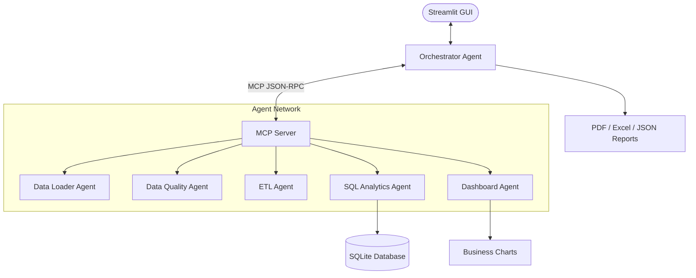

# 🚀 AI Data Engineering Agent Studio

<div align="center">


### 🏆 Kaggle AI Agents – Intensive Vibe Coding Capstone Project (Agents for Business Track)

*A Production-Ready Multi-Agent AI Data Engineering Platform powered by Model Context Protocol (MCP), Enterprise Security Guardrails, Intelligent ETL Pipelines, SQL Analytics, Interactive Dashboards, and Executive Report Generation.*

---

## 🌟 Project Overview

AI Data Engineering Agent Studio is a **fully local, offline-capable, production-style AI platform** that automates the complete data engineering workflow using a collaborative **Multi-Agent Architecture**.

Instead of relying on a single AI model, specialized agents independently perform data ingestion, quality assessment, ETL transformations, SQL analytics, dashboard generation, and professional reporting while communicating through the **Model Context Protocol (MCP)**.

Designed for enterprise-grade workflows, the platform emphasizes:

✅ Modular Multi-Agent Design

✅ Local & Offline Execution

✅ Secure MCP Tool Communication

✅ Automated ETL Pipelines

✅ Data Quality Assessment

✅ Natural Language SQL Analytics

✅ Business Intelligence Dashboard

✅ Executive PDF & Excel Reports


---

# 🏗️ System Architecture



---

# 📂 Project Structure

```text
AI-Data-Engineering-Agent-Studio/
│
├── agents/
│   ├── orchestrator.py
│   ├── loader_agent.py
│   ├── quality_agent.py
│   ├── etl_agent.py
│   ├── sql_agent.py
│   └── dashboard_agent.py
│
├── mcp_server/
│   └── server.py
│
├── tools/
│   ├── data_tools.py
│   └── reporting_tools.py
│
├── data/
│
├── reports/
│
├── logs/
│
├── app.py
├── requirements.txt
├── README.md
└── .gitignore
```

---

# 🤖 Multi-Agent Architecture

## 🎯 Orchestrator Agent

Acts as the brain of the system.

Responsible for:

- Coordinating every agent
- Pipeline execution
- State management
- Error handling
- Logging
- Report generation

---

## 📥 Data Loader Agent

Responsibilities

- Load CSV
- Load Excel
- Load JSON
- Detect schema
- Extract metadata
- Register datasets

---

## 🔍 Data Quality Agent

Performs enterprise-quality validation.

Checks:

- Missing values
- Duplicate records
- Outliers (IQR)
- Invalid formats
- Email validation
- Column statistics

Outputs

- Data Quality Score (0–100%)
- Detailed quality report

---

## ⚙️ ETL Agent

Automatically cleans datasets.

Operations include

- Rename columns
- Convert to snake_case
- Remove duplicates
- Handle null values
- Format currencies
- Convert datetime
- Normalize text
- Standardize columns

---

## 🧠 SQL Analytics Agent

Supports Natural Language Analytics.

Examples

> Show total sales by category

> Top 10 customers

> Monthly revenue trend

> Average order value

The agent converts prompts into optimized SQLite queries using

- Ollama LLM (if available)

OR

- Rule-Based SQL Compiler (Offline)

---

## 📊 Dashboard Agent

Automatically generates

- KPI Cards
- Category Analysis
- Histograms
- Pie Charts
- Bar Charts
- Correlation Heatmaps
- Trend Analysis
- Business Recommendations

---

# 🔌 MCP Server

Every agent communicates through the local **Model Context Protocol (MCP)** server.

Available MCP Tools

| Tool | Description |
|------|-------------|
| load_dataset() | Load datasets securely |
| dataset_summary() | Profile dataset |
| quality_check() | Run quality assessment |
| clean_dataset() | Execute ETL operations |
| run_sql_query() | Safe SQL analytics |
| generate_dashboard() | Create KPIs & Charts |
| export_report() | Generate PDF & Excel reports |

---

# 🛡️ Enterprise Security Features

Security is built into every layer.

### ✅ File Validation

- CSV
- Excel
- JSON only

---

### ✅ File Size Protection

Maximum upload size

**100 MB**

---

### ✅ Path Traversal Protection

Blocks access outside project workspace.

---

### ✅ SQL Injection Prevention

Dangerous SQL commands are rejected.

Blocked keywords include

- DROP
- DELETE
- UPDATE
- ALTER
- INSERT
- TRUNCATE

---

### ✅ Read-Only SQL Execution

Only safe commands are allowed

- SELECT
- WITH
- EXPLAIN
- PRAGMA

---

### ✅ Audit Logging

Every operation is recorded inside

```
logs/audit.log
```

---

# 🧠 Offline AI Intelligence

The platform includes a dual-engine AI system.

## Option 1 — Ollama

Uses local LLMs like

- qwen2.5-coder
- llama3

for

- SQL Generation
- Business Recommendations
- NLP Query Translation

---

## Option 2 — Rule-Based Engine

Works without internet or LLM.

Automatically understands queries such as

> Average Sales

> Top Products

> Monthly Revenue

> Sales by Category

using intelligent heuristic parsing.

---

# 📊 End-to-End Pipeline

```text
Dataset
     │
     ▼
Load Dataset
     │
     ▼
Schema Discovery
     │
     ▼
Quality Assessment
     │
     ▼
ETL Cleaning
     │
     ▼
SQLite Registration
     │
     ▼
Natural Language SQL
     │
     ▼
Business Dashboard
     │
     ▼
Executive Reports
```

---

# 🚀 Installation

## Clone Repository

```bash
git clone https://github.com/yourusername/AI-Data-Engineering-Agent-Studio.git

cd AI-Data-Engineering-Agent-Studio
```

---

## Install Dependencies

```bash
pip install -r requirements.txt
```

---

## (Optional) Install Ollama

```bash
ollama pull qwen2.5-coder

ollama pull llama3
```

Run Ollama

```bash
ollama serve
```

---

## Launch Streamlit

```bash
streamlit run app.py
```

---

# 📈 Application Workflow

### Step 1

Load sample dataset

```
data/sample_sales.csv
```

---

### Step 2

Inspect

- Schema
- Missing Values
- Outliers
- Quality Score

---

### Step 3

Run

```
End-to-End Pipeline
```

---

### Step 4

Automatically execute

- Data Cleaning
- ETL
- SQL Registration
- Dashboard Generation
- Report Compilation

---

### Step 5

Run Natural Language SQL

Example

```text
show total sales amount by category
```

---

### Step 6

View

- Dashboard
- Charts
- KPIs
- Business Insights

---

### Step 7

Download

- Clean CSV
- Excel Report
- PDF Report
- JSON Audit

---

# 📸 Features

✅ Multi-Agent AI Architecture

✅ Model Context Protocol (MCP)

✅ Enterprise Security

✅ Offline Support

✅ Ollama Integration

✅ Automated ETL

✅ SQL Analytics

✅ Interactive Dashboard

✅ PDF Reports

✅ Excel Reports

✅ SQLite Database

✅ Business KPIs

✅ Data Quality Score

✅ Audit Logs

---

# 🛠️ Technology Stack

| Category | Technologies |
|-----------|--------------|
| Language | Python |
| UI | Streamlit |
| Database | SQLite |
| Charts | Matplotlib, Seaborn |
| Reports | ReportLab, OpenPyXL |
| Data | Pandas, NumPy |
| AI | Ollama |
| Protocol | MCP |
| Logging | Python Logging |
| Security | Custom Guardrails |

---

# 🎯 Future Improvements

- Multi-file ingestion
- PostgreSQL support
- DuckDB integration
- Apache Spark connector
- Cloud deployment
- Scheduled pipelines
- AI Data Catalog
- RAG-based Documentation Search
- Vector Database Integration
- Multi-user Authentication

---

# 🏆 Why This Project?

This project demonstrates modern AI Data Engineering concepts including:

- Multi-Agent Systems
- Model Context Protocol (MCP)
- Enterprise Data Engineering
- Automated ETL Pipelines
- Business Intelligence
- Secure SQL Analytics
- Offline AI Workflows
- Production Software Architecture

It is an ideal portfolio project showcasing practical skills in AI Engineering, Data Engineering, and Enterprise Software Development.

---

# 👩‍💻 Author

**Vaishnavi Badwaik**

MCA Student • AI Engineer • Data Engineer • Machine Learning Enthusiast

---

## ⭐ If you found this project useful, consider giving it a Star!

**Made with ❤️ using Python, Streamlit, MCP, and AI Agents.**
