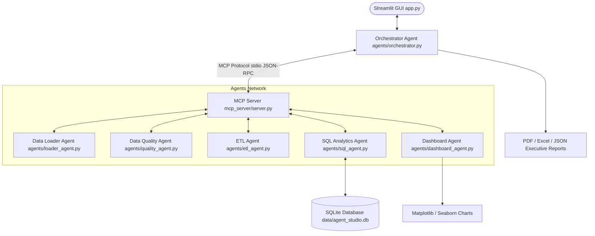

# AI Data Engineering Agent Studio

A production-ready, local, offline-capable AI Data Engineering Agent Studio built for the **Kaggle AI Agents: Intensive Vibe Coding Capstone Project (Agents for Business Track)**. 

The studio implements a multi-agent orchestration architecture coupled with Model Context Protocol (MCP) tool integrations, strict enterprise security guardrails, data quality scorers, ETL clean pipelines, natural language query interfaces, and professional report generators.

---

## 🏗️ System Architecture

The studio operates on a true multi-agent network, where each agent acts independently, communicating via standard **Model Context Protocol (MCP)** tool interfaces coordinated by the central **Orchestrator Agent**.



### File Structure
```text
project_root/
├── agents/
│   ├── __init__.py
│   ├── orchestrator.py      # Coordinating pipeline workflow and state
│   ├── loader_agent.py      # Schema discovery and metadata loader
│   ├── quality_agent.py     # Outlier, duplicate, format and null checkers
│   ├── etl_agent.py         # Imputing, deduplicating, name formatting
│   └── dashboard_agent.py   # Statistical KPIs, Seaborn plotting, recommendations
│
├── tools/
│   ├── __init__.py
│   ├── data_tools.py        # File, path, and SQL security guardrails
│   └── reporting_tools.py   # PDF (ReportLab), Excel (openpyxl) compilers
│
├── mcp_server/
│   └── server.py            # Local MCP Server exposing the 7 core tools
│
├── data/                    # SQLite database and dataset CSV files
│
├── reports/                 # Executive PDF, Excel sheets and JSON reports
│
├── logs/                    # Audit and system logs
│
├── app.py                   # Streamlit Frontend GUI
├── requirements.txt         # Open-source package requirements
├── README.md                # System documentation
└── .gitignore               # Ignored cache/database files
```

---

## 🤖 Agent Roles & Responsibilities

### 1. Orchestrator Agent (`agents/orchestrator.py`)
* Coordinates the sequential execution of agents (Loading -> Quality -> ETL -> SQL/Dashboard -> Report).
* Manages execution state logs in the live console window.
* Routes inputs/outputs between components.
* Initiates fallbacks and handles errors gracefully.

### 2. Data Loader Agent (`agents/loader_agent.py`)
* Loads CSV, Excel, and JSON files securely.
* Performs schema discovery, profiles columns, counts rows/cells, and extracts metadata.

### 3. Data Quality Agent (`agents/quality_agent.py`)
* Checks completeness (null distributions), uniqueness (duplicate counts), numerical outliers (IQR method), and emails formatting.
* Computes an overall composite **Data Quality Score (0-100%)**.

### 4. ETL Agent (`agents/etl_agent.py`)
* Sanitizes column headers to clean snake_case.
* Deduplicates datasets, cleans currency formatting, and casts datetime columns.
* Imputes missing numeric values (mean/median/mode/zero) and categorical cells.

### 5. SQL Analytics Agent (`agents/sql_agent.py`)
* Translates natural language prompts to SQLite queries (via local Ollama or high-speed rule-based Heuristics).
* Safely runs read-only analytical queries against the registered tables.
* Maintains a permanent, audit-ready SQL execution query history log.

### 6. Dashboard Agent (`agents/dashboard_agent.py`)
* Generates statistical business KPIs (averages, distributions, dominant categories).
* Generates charts (frequency bar, monthly trends line, categorical pie, histogram, correlation heatmap).
* Compiles dynamic business recommendations based on anomalies and statistical correlations.

---

## 🔌 Model Context Protocol (MCP) Server

The local MCP Server (`mcp_server/server.py`) exposes seven standard, reusable tools that agents invoke for all core operations:

1. `load_dataset(filepath)`: Securely ingests raw dataset and returns dimensions.
2. `dataset_summary(filepath)`: Extracts schema data types and unique counts.
3. `quality_check(filepath)`: Audits files for outliers, nulls, duplicates.
4. `clean_dataset(filepath, operations_json)`: Executes ETL pipeline transformations.
5. `run_sql_query(query, filepath)`: Translates natural language, executes safe SQL on SQLite.
6. `generate_dashboard(filepath)`: Generates KPIs, exports Seaborn charts, compiles recommendations.
7. `export_report(metadata, quality, etl, insights, charts)`: Compiles audit files into PDF and Excel reports.

---

## 🛡️ Enterprise Security Guardrails

The application prioritizes robust security, validating inputs before any operation:

* **File Type Validation**: Rejects unsupported file structures. Only CSV, Excel, and JSON are allowed.
* **File Size Constraints**: Prevents denial of service by rejecting uploads larger than 100MB.
* **Path Traversal Protection**: Resolves all relative file paths, blocking access to directories outside the project workspace.
* **SQL Injection Prevention**: Blocks malicious keywords (`DROP`, `DELETE`, `TRUNCATE`, `ALTER`, `UPDATE`, `INSERT`, etc.) case-insensitively using exact-word boundary matching.
* **Strict Read-Only Enforcement**: Ensures only safe queries (`SELECT`, `WITH`, `EXPLAIN`, `PRAGMA table_info`) are executed.
* **Traceable Auditing**: Maintains detailed execution history logs inside `logs/audit.log`.

---

## ⚙️ Offline Heuristic Fallback System

To satisfy cost constraints (100% free) and run offline without complex local LLM installations, the studio includes a **dual-mode intelligence engine**:

* **Ollama Mode**: If Ollama is running on localhost (`http://localhost:11434`), the studio connects to active models like `qwen2.5-coder` or `llama3` for SQL generation and consultative recommendations.
* **Rule-Based Heuristic Mode**: If Ollama is offline or uninstalled, the studio automatically switches to a custom NLP heuristic compiler. This compiler matches query entities with SQL structures (e.g., matching aggregates like "average sales" to `AVG(sales_amount)`, grouping keywords like "by product" to `GROUP BY product_category`, and sorting keys like "top 10" to `ORDER BY value DESC LIMIT 10`), ensuring the studio remains functional out of the box.

---

## 🚀 Installation & Setup

1. **Clone the project repository** to your local workspace.
2. **Install Python dependencies**:
   ```bash
   pip install -r requirements.txt
   ```
3. *(Optional)* **Configure Ollama for LLM Translation**:
   * Install [Ollama](https://ollama.com).
   * Pull your preferred coder models:
     ```bash
     ollama pull qwen2.5-coder
     ollama pull llama3
     ```
   * Ensure Ollama is running locally on your default port (`http://localhost:11434`).
4. **Launch the Streamlit GUI Application**:
   ```bash
   streamlit run app.py
   ```

---

## 📊 Verification Walkthrough

1. Open the application in your browser.
2. In the sidebar control panel, click **Load Pre-defined Messy Sales CSV** (which reads `data/sample_sales.csv`).
3. Check the **Ingestion & Quality** tab to inspect the raw file size, missing value metrics, IQR outliers, and format issues.
4. Click **Run End-to-End Pipeline 🚀** in the sidebar to execute the loaders, data quality scorers, ETL cleanings, Seaborn plotters, and report compilers.
5. In the **ETL Pipeline** tab, download the newly cleaned CSV and check the transformation logs.
6. In the **SQL Query Studio**, type your analytical queries (e.g., `show total sales amount by product category`).
7. Enter a malicious query like `DROP TABLE dataset;` or `SELECT * FROM dataset; DROP TABLE dataset;` to verify that the security guards immediately block the execution.
8. Go to the **Analytics Dashboard** to see KPI cards, insights, and visualizations.
9. Go to the **Executive Audit Log** tab to inspect logs and download the compiled report files.
# AI-Data-Engineer-Agent-Studio

